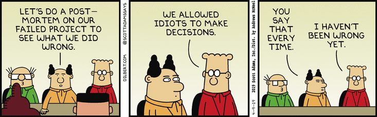

# POSTMORTEM REPORT FOR A TRAINEES PORTAL

`Duration of the outage with start and end times (including timezone)`

Start of Outage: 13th September 2021 6:00 am UTC

End of Outage: 27th September 2021 6:00 am UTC

`What was the impact (What service was down/slow?, What were users experiencing?, How many % of the users were affected?)`

Registration and Login Services were down. Users were not able to access course material as they couldn’t access the platform. All users were affected making it a percentage of 100.

`What was the root cause?`

Users couldn’t register or login onto the portal

`When was the issue detected?`

When the portal was opened to users

`How was the issue detected (monitoring alert, an engineer noticed something, a customer complained…)`

Users complained about not being able to access the portal. 

`Actions taken (what parts of the system were investigated, what were the assumption on the root cause of the issue)`

Registration and login parts of the system were investigated and it was assumed that users were registering multiple times.

`Misleading investigation/debugging paths that were taken`

Refreshing the system

`Which team/individuals were the incidents escalated to`

Users were directed to email the incidents to the tech support team.

`How the incident was resolved`

Password reset was done for all users who couldn’t log in and those who couldn’t register were asked to re-register.

`Explain in detail what was causing the issue`

Some users couldn’t successfully register whiles others were able to register but they could log in to the accounts to access their portal. There was a bug with the code that broke it hence its expected function wasn’t executed as it was supposed to.

`Explain in detail how the issue was fixed`

Verify is the user is already registered and can log in. If registration was unsuccessful then we check if registration was initialized and also their credential was captured in the database as they were trying to register. If so, we remove the credentials that were captured and refresh the system. Then we ask the user to re-register. 
If the user can’t log in was above o successfully register then we reset the password to default and provide the user with the new default password and ask them to log in and change their password to a preferred one.

`What are the things that can be improved/fixed (broadly speaking)`

Response time to complaints about the platform.

Understanding the incident being reported before trying to solve the issue.

`A list of tasks to address the issue (be very specific, like a TODO, example: patch Nginx server, add monitoring on server memory…)`

Verify is the user is already registered and can log in 

`If registration was unsuccessful;`
<li>Check if registration was initialized and credential was captured in the database
<li>Remove credentials if captured
<li>Refresh system
<liAsk the user to re-register</ul>  
  
`If the user can’t log in;`
<li>Reset password to a default
<li>Provide user with the new default password and ask them to log in and change their password to a preferred one.

Blog post link: https://medium.com/@maameyaasarp/77f4d487e0ca
